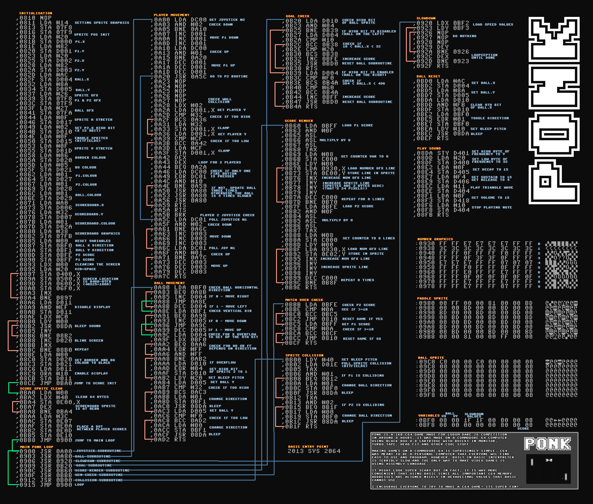

# C64 Assembler - Pong

This is WIP of converting [Ponk](http://sos.gd/ponk/) to KickAssembler

### TODO:

- [ ] Display sprites correctly
- [x] Sound
- [x] Joystick handling
- [x] Test game, gameplay
- [X] Check sprite memory
- [X] Use variables in STAx and LDx (at work)
- [x] Check variables
- [x] Write old style ASM
- [x] JMP,JSP: Use labels instead of memory adresses
- [x] BNE,BCS,BCC,BEQ: Use labels instead of memory adresses
- [x] Convert to KickAsembler format
- [x] Can be asembled

### Original "Source"

